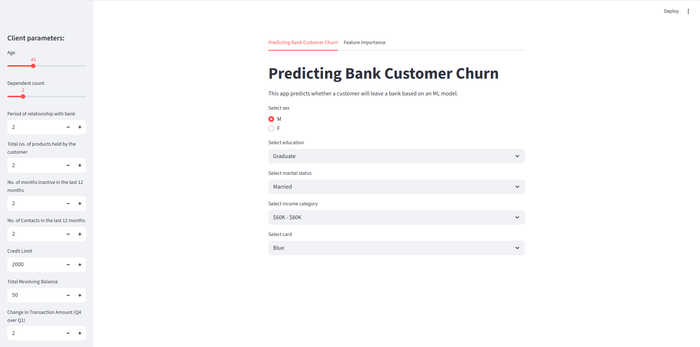
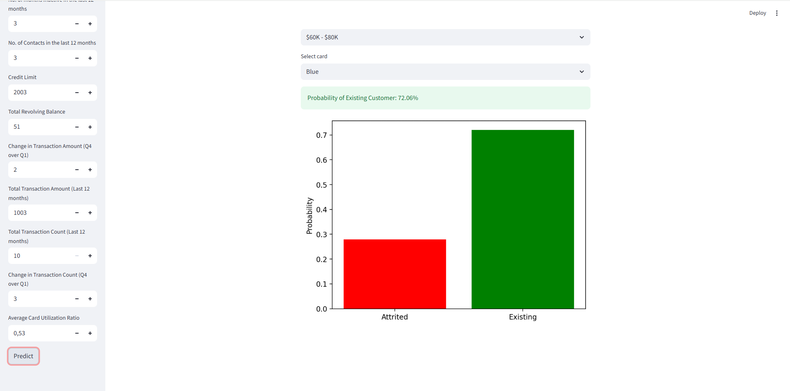
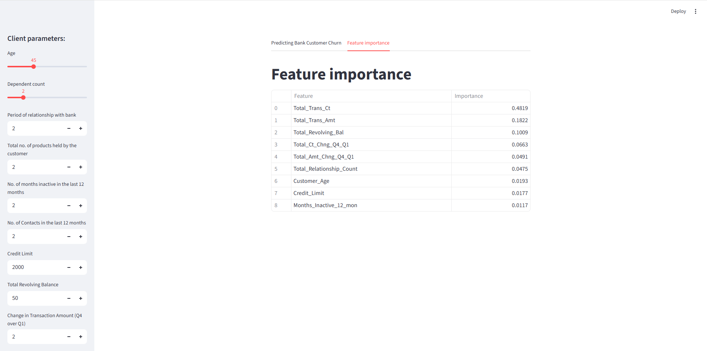

# Bank Customer Churn Prediction


## Metrics


ML модель для прогнозирования оттока клиентов банка с веб-интерфейсом.

## О проекте

Проект решает задачу прогнозирования оттока клиентов банка. Модель машинного обучения анализирует  характеристики клиентов и предсказывает вероятность их ухода с точностью **96%**.

## Ключевые особенности

-   **Точность**: F1-Score = 0.90 для миноритарного класса
-   **Интерактивный интерфейс**: Streamlit-приложение с визуализацией
-   **Простота развертывания**: Docker-контейнеризация
-   **Интерпретируемость**: Анализ важности признаков модели

## Результаты

| Метрика | Значение |
|---------|----------|
| **Accuracy** | 0.96 |
| **F1-Score** | 0.90 |
| **Recall** | 0.89 |
| **Precision** | 0.91 |

## Технологический стек

-   **Язык программирования**: Python 3.11
-   **ML фреймворк**: Scikit-learn, Gradient Boosting
-   **Веб-интерфейс**: Streamlit
-   **Контейнеризация**: Docker
-   **Анализ данных**: Pandas, NumPy, Matplotlib

## Скриншоты

### Главный интерфейс


### Пример предсказания


### Главные признаки


## Запуск

```bash
# Клонировать репозиторий
git clone https://github.com/your-username/bank-churn-prediction.git

# Установить зависимости
pip install -r requirements.txt

# Запустить приложение
streamlit run streamlit_app.py

### Docker-запуск
```bash
# Собрать образ
docker build -t churn-app .

# Запустить контейнер
docker run -p 8501:8501 churn-app
